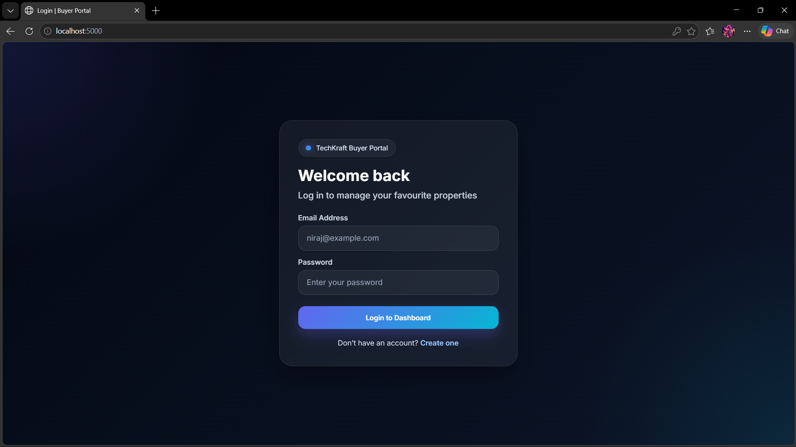
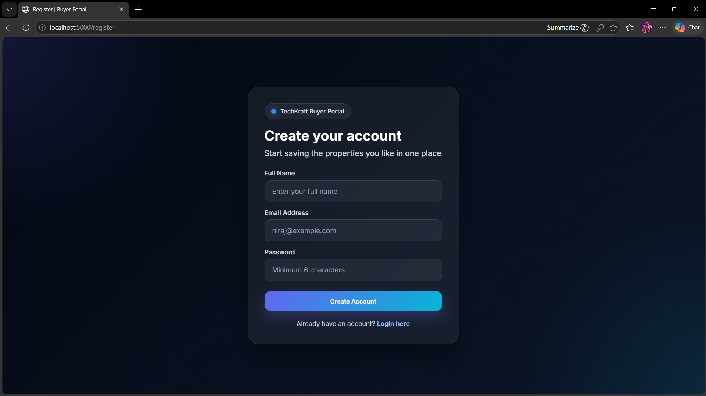
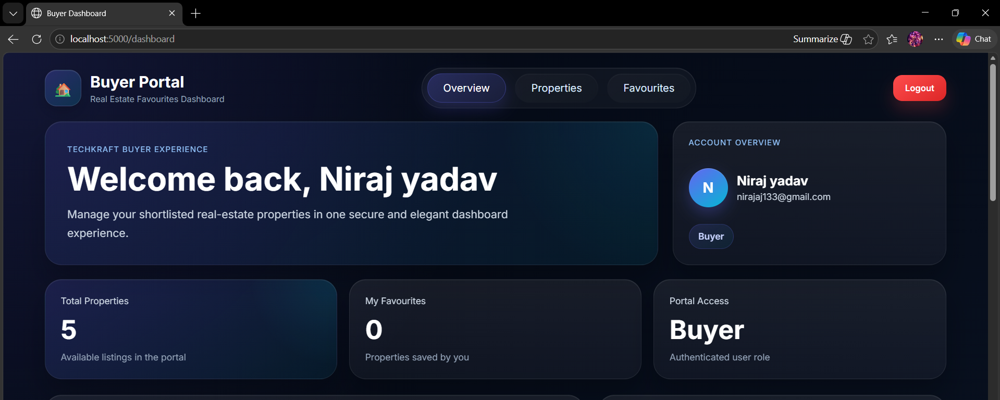
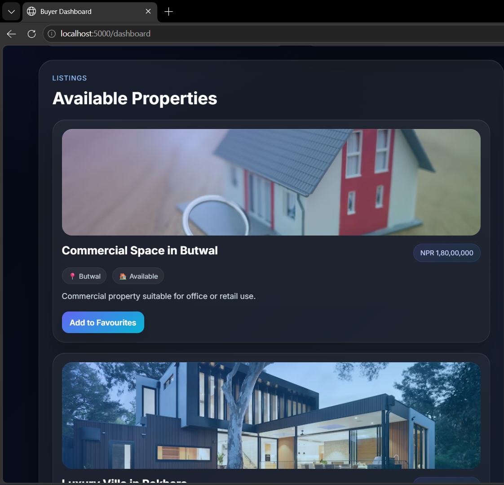
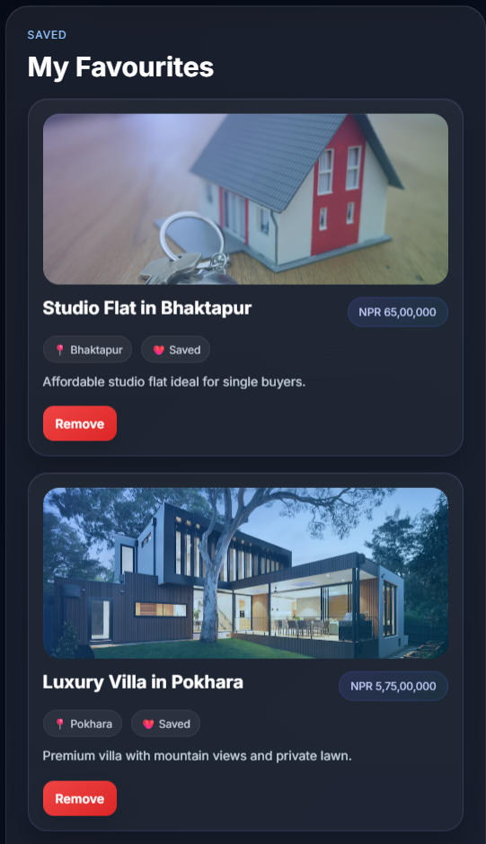

# Buyer Portal – Auth + Favourites Dashboard

A full-stack buyer portal built as part of the **TechKraft Inc. Junior Full-Stack Engineer take-home assessment**.

This application allows users to:

- register with email and password
- log in securely using JWT authentication
- view their profile information
- browse available properties
- add and remove favourite properties
- access only their own saved favourites

---

## Features

### Authentication
- User registration with validation
- Secure login using email and password
- Password hashing using **bcrypt**
- JWT-based authentication for protected routes

### Buyer Dashboard
- Displays authenticated user information
- Shows user name, email, and role
- Lists all available properties
- Allows users to add/remove favourites
- Restricts access so users can only manage **their own** favourites

### Backend
- REST API built with **Node.js** and **Express**
- SQLite database for lightweight local storage
- Server-side validation and error handling
- Protected routes with authentication middleware

### Frontend
- Clean and responsive UI
- Login page
- Register page
- Premium buyer dashboard
- Property cards with favourite actions

---

## Tech Stack

### Frontend
- HTML
- CSS
- Vanilla JavaScript

### Backend
- Node.js
- Express.js

### Database
- SQLite

### Authentication & Security
- JWT
- bcryptjs

---

## Project Structure

```bash
buyer-portal/
├── client/
│   ├── css/
│   │   └── styles.css
│   ├── js/
│   │   ├── login.js
│   │   ├── register.js
│   │   └── dashboard.js
│   ├── dashboard.html
│   ├── login.html
│   └── register.html
│
├── server/
│   ├── middleware/
│   │   └── auth.js
│   ├── routes/
│   │   ├── auth.js
│   │   ├── favourites.js
│   │   └── properties.js
│   ├── database.sqlite
│   ├── db.js
│   └── index.js
│
├── screenshots/
│   ├── login.png
│   ├── register.png
│   ├── dashboard.png
│   ├── properties.png
│   └── favourites.png
│
├── .env
├── package.json
└── README.md
## Screenshots

### Login Page


### Register Page


### Dashboard Overview


### Available Properties


### My Favourites


---
## How to Run the App

### 1. Clone the repository
```bash
git clone <your-github-repo-url>
cd buyer-portal

### 2. Install dependencies
```bash
npm install

### 3. Create environment file
Create a `.env` file in the root directory with the following values:

```env
PORT=5000
JWT_SECRET=your_secret_key_here

### 4. Start the development server
```bash
npm run dev

### 5. Open in browser
Visit:

```bash
http://localhost:5000

## Example User Flow

1. Register a new account
2. Log in using your registered email and password
3. View your buyer dashboard
4. Browse available properties
5. Add a property to favourites
6. View saved favourites
7. Remove a property from favourites

---

## API Endpoints

### Auth Routes
- `POST /api/auth/register` – Register a user
- `POST /api/auth/login` – Login user
- `GET /api/auth/me` – Get authenticated user info

### Property Routes
- `GET /api/properties` – Get all properties

### Favourite Routes
- `GET /api/favourites` – Get logged-in user's favourites
- `POST /api/favourites` – Add property to favourites
- `DELETE /api/favourites/:propertyId` – Remove property from favourites

---

## Security Considerations

- Passwords are never stored in plain text
- Passwords are hashed using **bcrypt**
- Protected routes require a valid JWT token
- Users can only access and modify their own favourites
- Server-side validation is implemented for authentication and favourite actions

---

## Database Design

### `users`
- `id`
- `name`
- `email`
- `password_hash`
- `role`
- `created_at`

### `properties`
- `id`
- `title`
- `location`
- `price`
- `description`
- `created_at`

### `favourites`
- `id`
- `user_id`
- `property_id`
- `created_at`

---

## Notes

- Sample properties are seeded automatically on initial startup
- SQLite is used for simplicity and quick local setup
- The UI is designed to be clean, modern, and responsive

---

## Author

**Niraj Yadav**

Submitted for the **Junior Full-Stack Engineer Take-Home Assessment** at **TechKraft Inc.**